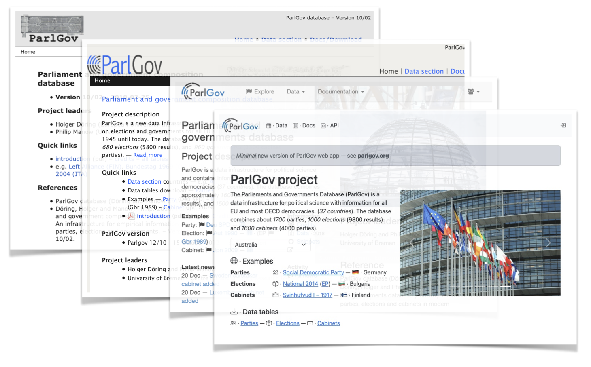

# ParlGov · 🗳️

Static page of ParlGov project — [parlgov.org](https://parlgov.org/)

ParlGov is a data infrastructure with information about EU and OECD democracies from 1900 to 2023.

- [ParlGov Dataverse](https://dataverse.harvard.edu/dataverse/parlgov) — data archive
- [parlgov.fly.dev](https://parlgov.fly.dev/) — dynamic page
- [ParlGov snippets](https://github.com/hdigital/parlgov-snippets) — examples in R

## Usage · 💡

See built page at [parlgov.org](https://parlgov.org)

Build and preview page with

```sh
R -e 'blogdown::build_site()'

R -e 'blogdown::serve_site()'
```

Add new post

- copy `./content/post/2024-template.md`
- update file name — date and slug
- update header — add title and date, `draft: false`
- _optional_ — update image from `.static/images` folder

## Installation · ⚙️

Use [blogdown](https://github.com/rstudio/blogdown) with R.

```sh
R -e 'install.packages("blogdown")'
```

Format files with [prettier](https://prettier.io/docs/en/cli).

```sh
prettier -w ./**/*.{md,yaml}
```

## License · ⚖️

Data from [ParlGov
Dataverse](https://dataverse.harvard.edu/dataset.xhtml?persistentId=doi:10.7910/DVN/2VZ5ZC)
is licensed [CC0 1.0](https://creativecommons.org/publicdomain/zero/1.0/).

---


